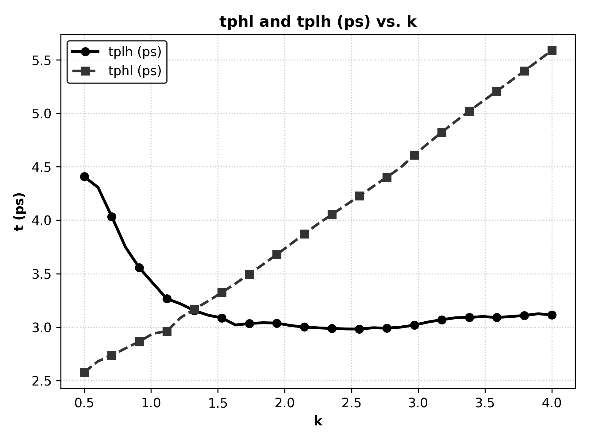
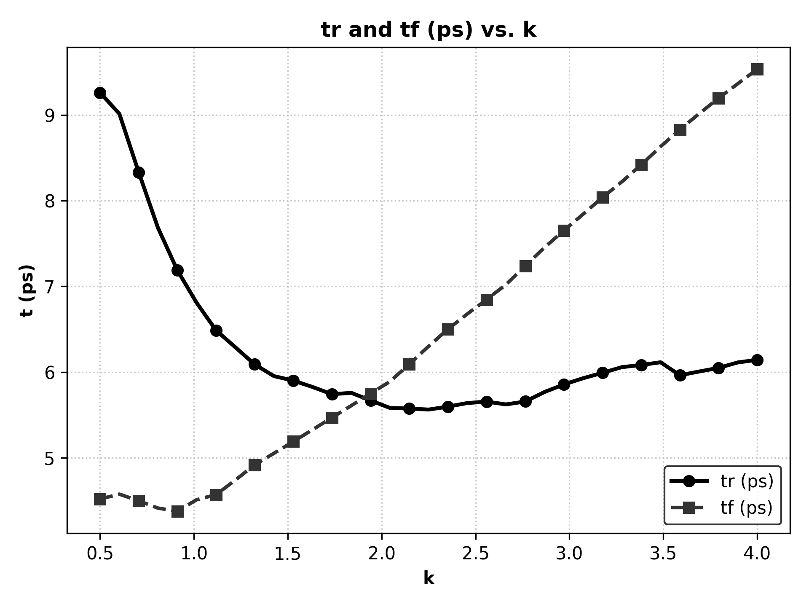
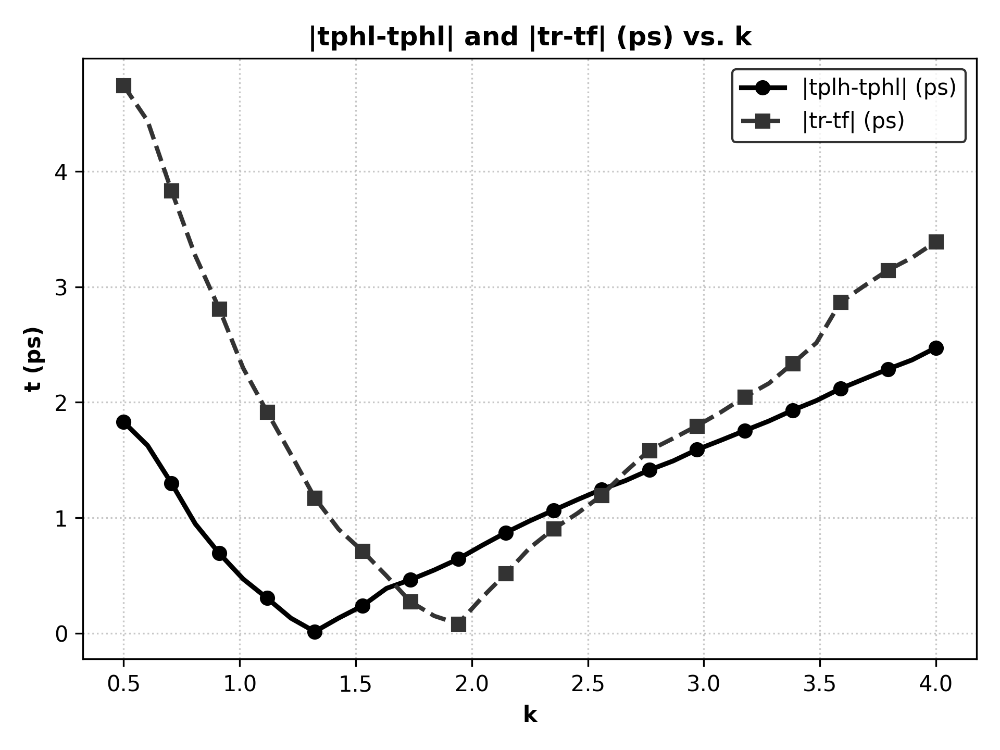

# inv_7x output
|      k |      tplh |      tphl |        tr |        tf |   diff_tplh_tphl |   diff_tr_tf |   temper |   alter# |
|-------:|----------:|----------:|----------:|----------:|-----------------:|-------------:|---------:|---------:|
| 0.5    | 4.408e-12 | 2.578e-12 | 9.26e-12  | 4.518e-12 |        1.829e-12 |    4.743e-12 |       25 |        1 |
| 0.6029 | 4.307e-12 | 2.681e-12 | 9.013e-12 | 4.575e-12 |        1.626e-12 |    4.438e-12 |       25 |        1 |
| 0.7059 | 4.034e-12 | 2.735e-12 | 8.331e-12 | 4.497e-12 |        1.299e-12 |    3.834e-12 |       25 |        1 |
| 0.8088 | 3.748e-12 | 2.802e-12 | 7.681e-12 | 4.412e-12 |        9.463e-13 |    3.269e-12 |       25 |        1 |
| 0.9118 | 3.556e-12 | 2.865e-12 | 7.187e-12 | 4.376e-12 |        6.915e-13 |    2.811e-12 |       25 |        1 |
| 1.0147 | 3.41e-12  | 2.94e-12  | 6.807e-12 | 4.51e-12  |        4.696e-13 |    2.297e-12 |       25 |        1 |
| 1.1176 | 3.266e-12 | 2.962e-12 | 6.487e-12 | 4.569e-12 |        3.038e-13 |    1.918e-12 |       25 |        1 |
| 1.2206 | 3.218e-12 | 3.088e-12 | 6.289e-12 | 4.739e-12 |        1.301e-13 |    1.55e-12  |       25 |        1 |
| 1.3235 | 3.155e-12 | 3.168e-12 | 6.089e-12 | 4.917e-12 |        1.317e-14 |    1.172e-12 |       25 |        1 |
| 1.4265 | 3.112e-12 | 3.243e-12 | 5.952e-12 | 5.052e-12 |        1.311e-13 |    8.996e-13 |       25 |        1 |
| 1.5294 | 3.086e-12 | 3.324e-12 | 5.9e-12   | 5.189e-12 |        2.373e-13 |    7.108e-13 |       25 |        1 |
| 1.6324 | 3.02e-12  | 3.408e-12 | 5.825e-12 | 5.328e-12 |        3.88e-13  |    4.97e-13  |       25 |        1 |
| 1.7353 | 3.034e-12 | 3.497e-12 | 5.741e-12 | 5.468e-12 |        4.623e-13 |    2.728e-13 |       25 |        1 |
| 1.8382 | 3.041e-12 | 3.587e-12 | 5.757e-12 | 5.608e-12 |        5.47e-13  |    1.493e-13 |       25 |        1 |
| 1.9412 | 3.038e-12 | 3.68e-12  | 5.668e-12 | 5.749e-12 |        6.423e-13 |    8.07e-14  |       25 |        1 |
| 2.0441 | 3.015e-12 | 3.775e-12 | 5.581e-12 | 5.889e-12 |        7.601e-13 |    3.083e-13 |       25 |        1 |
| 2.1471 | 3.001e-12 | 3.873e-12 | 5.574e-12 | 6.092e-12 |        8.715e-13 |    5.173e-13 |       25 |        1 |
| 2.25   | 2.993e-12 | 3.966e-12 | 5.562e-12 | 6.301e-12 |        9.727e-13 |    7.393e-13 |       25 |        1 |
| 2.3529 | 2.988e-12 | 4.053e-12 | 5.596e-12 | 6.5e-12   |        1.065e-12 |    9.04e-13  |       25 |        1 |
| 2.4559 | 2.983e-12 | 4.14e-12  | 5.638e-12 | 6.677e-12 |        1.157e-12 |    1.039e-12 |       25 |        1 |
| 2.5588 | 2.982e-12 | 4.227e-12 | 5.655e-12 | 6.846e-12 |        1.245e-12 |    1.192e-12 |       25 |        1 |
| 2.6618 | 2.994e-12 | 4.315e-12 | 5.622e-12 | 7.02e-12  |        1.321e-12 |    1.398e-12 |       25 |        1 |
| 2.7647 | 2.99e-12  | 4.403e-12 | 5.656e-12 | 7.239e-12 |        1.413e-12 |    1.583e-12 |       25 |        1 |
| 2.8676 | 3e-12     | 4.492e-12 | 5.767e-12 | 7.454e-12 |        1.492e-12 |    1.687e-12 |       25 |        1 |
| 2.9706 | 3.019e-12 | 4.609e-12 | 5.855e-12 | 7.651e-12 |        1.59e-12  |    1.796e-12 |       25 |        1 |
| 3.0735 | 3.048e-12 | 4.719e-12 | 5.928e-12 | 7.843e-12 |        1.671e-12 |    1.915e-12 |       25 |        1 |
| 3.1765 | 3.069e-12 | 4.824e-12 | 5.991e-12 | 8.038e-12 |        1.755e-12 |    2.047e-12 |       25 |        1 |
| 3.2794 | 3.088e-12 | 4.925e-12 | 6.057e-12 | 8.22e-12  |        1.837e-12 |    2.163e-12 |       25 |        1 |
| 3.3824 | 3.091e-12 | 5.022e-12 | 6.082e-12 | 8.418e-12 |        1.931e-12 |    2.336e-12 |       25 |        1 |
| 3.4853 | 3.099e-12 | 5.115e-12 | 6.114e-12 | 8.63e-12  |        2.015e-12 |    2.516e-12 |       25 |        1 |
| 3.5882 | 3.09e-12  | 5.208e-12 | 5.962e-12 | 8.828e-12 |        2.118e-12 |    2.866e-12 |       25 |        1 |
| 3.6912 | 3.099e-12 | 5.302e-12 | 6.006e-12 | 9.015e-12 |        2.203e-12 |    3.009e-12 |       25 |        1 |
| 3.7941 | 3.109e-12 | 5.396e-12 | 6.048e-12 | 9.194e-12 |        2.288e-12 |    3.145e-12 |       25 |        1 |
| 3.8971 | 3.125e-12 | 5.492e-12 | 6.112e-12 | 9.365e-12 |        2.367e-12 |    3.253e-12 |       25 |        1 |
| 4      | 3.115e-12 | 5.588e-12 | 6.142e-12 | 9.532e-12 |        2.473e-12 |    3.391e-12 |       25 |        1 |
## Graphical Ouputs

    

    

    

            
