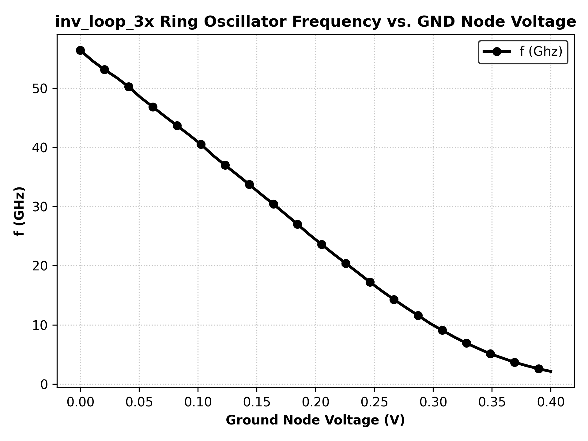
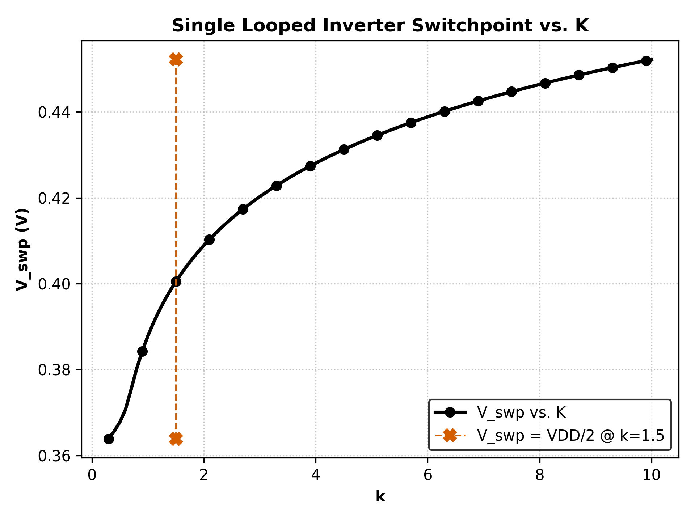

# Exercise 2.a

## Using a 21x Inverter Ring Oscillator
The Period of the ring oscillator should match the following equation based on the results from Exercise 1 (see `inv_7x.md`)
```
tplh = tphl = T / (<num_stages>*2)
```
Using the results from Exercise 1 and Exercise 2.a:
| k | tplh (ps) | tphl (ps) | T / 42 (ps) |
|-|-|-|-|
| 1.3 |  3.135 | 3.101 |   3.132 |
## Current Starving a 3x Inverter Ring Oscillator

When we increase the voltage of the ground node, we are decreasing the net voltage difference across VDD and ground and therefore reducing the drive strength each stage. This results in a slower frequency as shown below.
<p align="center">
    
</p>

> This was done by sweeping the ground node of the ring oscillator from `0V` to `Vdd/2`

# Exercise 2.5 (AKA 2.b)

## Single Looped Inverter for Determining Voltage Switchpoint
Below we plot the switch point of an inverter for various k by tying the input of the inverter directly to the output. In a standard VTC, Vout is plotted against Vin, and the point where Vout=Vin is known as the voltage switpoint. Here we are using a single loop inverter to determine the switchpoint without sweeping Vin. 

By sweeping k instead, we see the effect of varrying the strength of the pmos transistor relative to the nmos on the swithpoint. A symmetric inverter should occur when `V_swp = VDD/2`.
<p align="center">
    
</p>