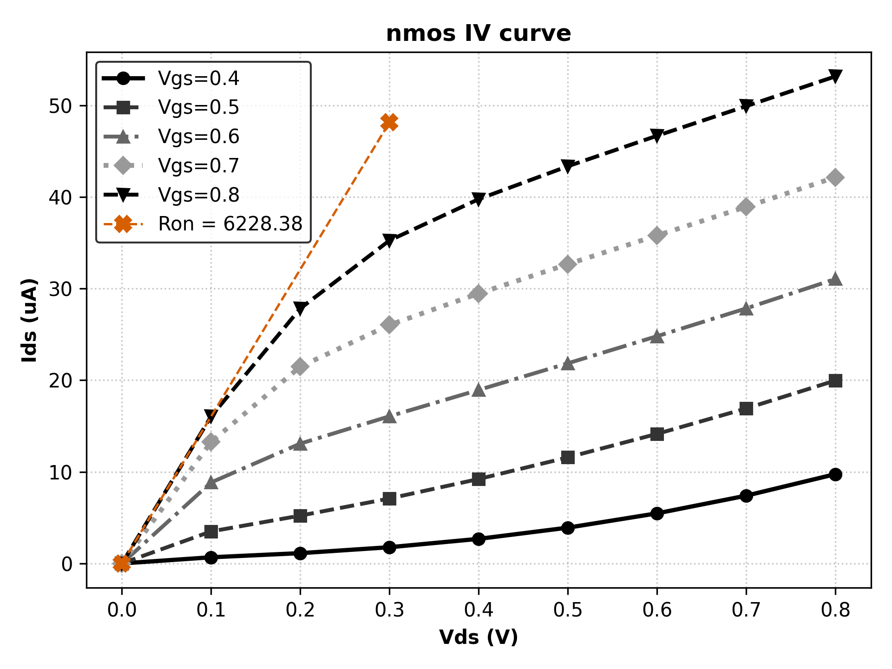
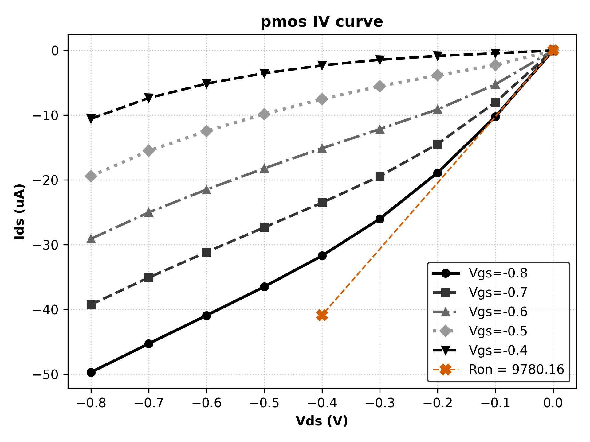

# NMOS and PMOS IV Characteristic Curve

# Calculated Ron
- TOXE = Electrical Oxide Thickness (see A.2 BSIM4 User's Manual)
    - Default = 3nm
    - Model Card = 1.05nm (NMOS); 1.1nm (PMOS)
- EPSROX = Gate Dielectric Constant Relative to Vacuum (see A.2 BSIM4  User's Manual)
    - Default = 3.9 = Model card
- U0 = Low-Field Mobility (see A.5 2 BSIM4 User's Manual)
    - Default = 0.067 m^2/(Vs) (NMOS); 0.025 m^2/(Vs) PMOS
    - Model card =  0.04  m^2/(Vs) (NMOS); 0.0095 m^2/(Vs) PMOS
- VTH0 or VTHO = Long-channel threshold voltage at Vbs=0 (see A.5 2 BSIM4 User's Manual)
    - Default =  0.7V (NMOS); -0.7V (PMOS)
    - Model Card = 0.50308V (NMOS); -0.4606 V (PMOS)
- VGS = VDD = 0.8V (NMOS), = -0.8 (PMOS)

## NMOS Ron
| Ron Caclulated Using BSIM4 Defaults (ohm) | Ron Calculated Using Model Card (Ohm) | Ron Simulated |
|-|-|-|
| 6485 | 1280.11 | 6228.38 |

## PMOS Caclulated ROn
| Ron Caclulated Using BSIM4 Defaults (ohm) | Ron Calculated Using Model Card (Ohm) | Ron Simulated |
|-|-|-|
| 13365.79 | 3799.88 | 97980.16 |

    
    

