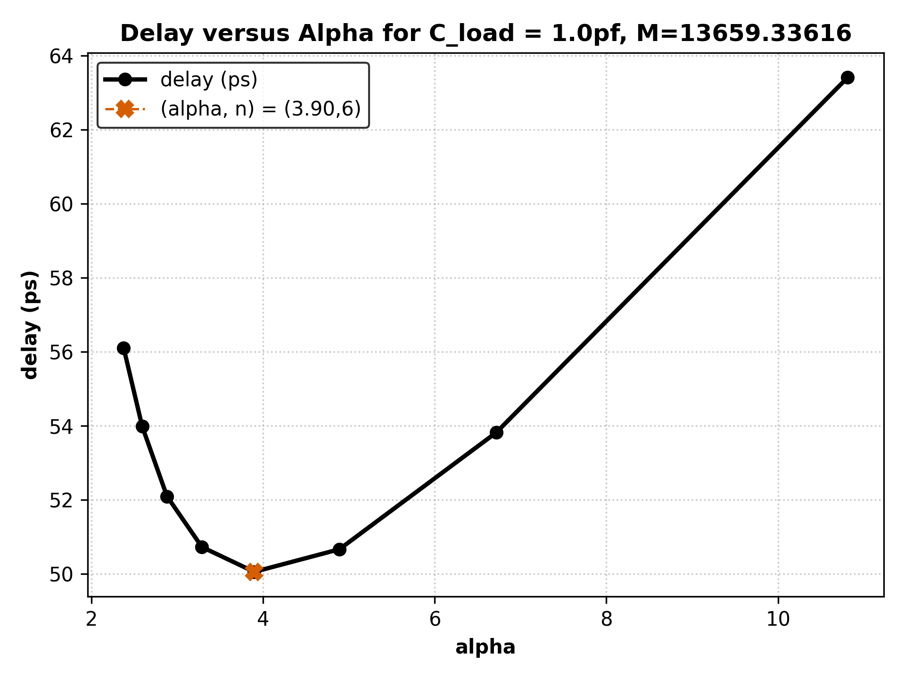
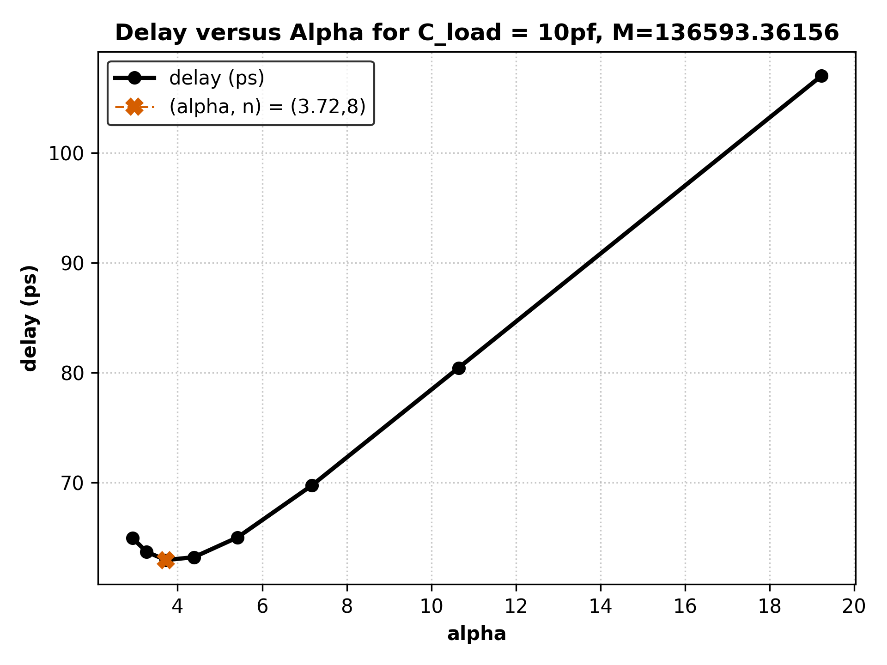

# Exercise 5

Sizing `n` inverters to drive a `1pf` and `10pf` load using incremental size increases by factor alpha. Plotting `delay (ps)` against `(alpha, n)` pairs to determine optimal alpha.

    
    

